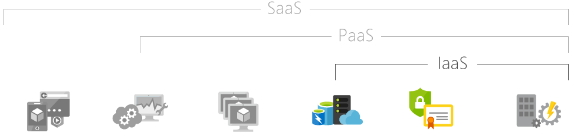

**What is DevOps?**
- A methodology focused on cross-disciplinary practices involving the development, deployment and maintenance of a product.
- It's the combination of both development and operation techniques into one team that is responsible for the entire lifecycle of a product.

**Why DevOps?**
- It enables a much faster development of products as well as an easier maintenance of existing deployments.
- Automation allows extremely efficient workflows.
- Analysis done [here](https://services.google.com/fh/files/misc/state-of-devops-2019.pdf) shows that top-performing companies that apply DevOps exceed others on software development and deployment.

**Tools of DevOps**
- The most common include:
    - Git
    - Jenkins
    - Docker
    - Kubernetes
    - Ansible

**SAAS, PAAS, IAAS**
- SAAS = "software as a service"
    - It's a cloud-based service that allows you to use apps using only an internet browser e.g. email
- PAAS = "platform as a service"
    - This is a complete development and deployment environment all on the cloud.
- IAAS = "infrastructure as a service"
    - This is an instant computing infrastrucure provisioned and managed over the internet.

---
**Used:**
- [Why DevOps](https://www.appdynamics.com/solutions/devops/why-devops-is-important#:~:text=DevOps%20is%20important%20because%20it's,easier%20maintenance%20of%20existing%20deployments.)
- [SAAS, PAAS and IAAS](https://azure.microsoft.com/en-gb/overview/what-is-iaas/)