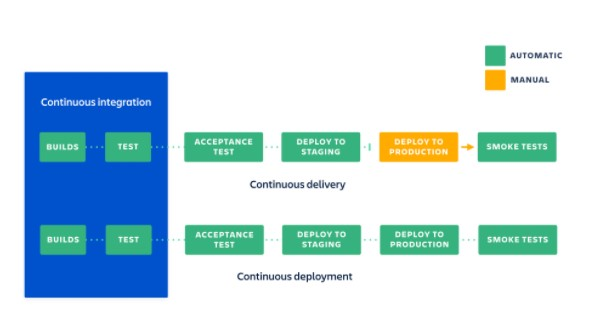

# What is DevOps?
- A methodology focused on cross-disciplinary practices involving the development, deployment and maintenance of a product.
- It's the combination of both software development and IT operations into one team,responsible for the entire lifecycle of a product.

 

## Why DevOps?
- It enables a much faster development of products as well as an easier maintenance of existing deployments.
- Automation allows extremely efficient workflows.
- Analysis done [here](https://services.google.com/fh/files/misc/state-of-devops-2019.pdf) shows that top-performing companies that apply DevOps exceed others on software development and deployment.
- Improves collaboration and productivity.

 

## Tools of DevOps
- The most common include:
    - Git
    - Jenkins/Bamboo
    - Docker
    - Kubernetes
    - Ansible
    - Chef/Puppet

 

## CI/CD

**Continuous Integration**
- Developers practicing CI will try to merge their code as often as possible. They can do this because there would be an automated way to build and test it and ensures that the code is only ever pushed when all tests are passed

 

**Continuous Delivery vs. Continuous Deployment**

- Continuous delivery extends upon CI and will deploy all code changes to a testing and/or production environment. You have an automated release process and can deploy the app with a click of a button (i.e. **manually**)

- Continuous deployment goes above what is done in Continuous Delivery and every change that passes each stage of the pipeline is automatically deployed into production -- there is no human intervention and deployment will only be cancelled when there is a failure in the pipeline that is detected

 

## Cloud computing
- The delivery of computing services (servers, databases, infrastructure etc.) over the internet.
- More cost-efficient as most of the time you only pay for what you use.
- Far more flexible as you can access services as long as you have internet access.

 

## SAAS, PAAS, IAAS
- SAAS = "software as a service"
    - It's a cloud-based service that allows you to use apps using only an internet browser e.g. email
- PAAS = "platform as a service"
    - This is a complete development and deployment environment all on the cloud e.g. Windows Azure
- IAAS = "infrastructure as a service"
    - This is an instant computing infrastrucure provisioned and managed over the internet e.g. AWS

 

## Hybrid and public clouds
- Public clouds are the most common, these are resources that are owned, maintained and operated by third-party providers. These are delivered through the internet.
- Hybrid cloud computing is a type of cloud computing that combines both real-life infrastructure (a private cloud) with a public cloud.
    - Can be used to meet regulatory and data sovereignty requirements.

 

## When to use SAAS, PAAS, and IAAS
- Use SAAS when you need quick and easy deployment. Usually used for short-term projects and ones that aren't needed too often.
- Use PAAS to streamline workflows whenever multiple developers are working on the same development project.
- Use IAAS if you are a rapidly-growing company. This allows you to take advantage of the flexbility and ease of scalability of IAAS while also having the option to change out specific hardware and software needs as required.

 

---
**Used:**
- [What is DevOps](https://aws.amazon.com/devops/what-is-devops/)
- [Why DevOps](https://www.appdynamics.com/solutions/devops/why-devops-is-important#:~:text=DevOps%20is%20important%20because%20it's,easier%20maintenance%20of%20existing%20deployments.)
- [SAAS, PAAS and IAAS](https://azure.microsoft.com/en-gb/overview/what-is-iaas/)
- [Cloud + Private and Hybrid cloud](https://azure.microsoft.com/en-gb/overview/what-are-private-public-hybrid-clouds/#deployment-options)
- [Why SAAS, PAAS, and IAAS](https://www.bmc.com/blogs/saas-vs-paas-vs-iaas-whats-the-difference-and-how-to-choose/)